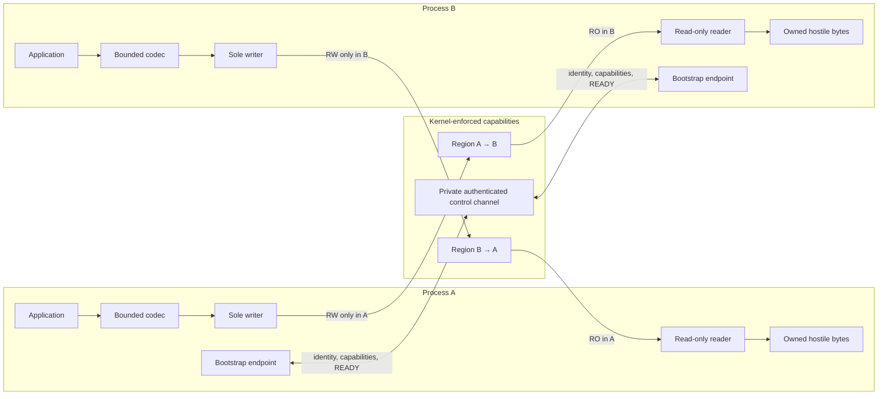
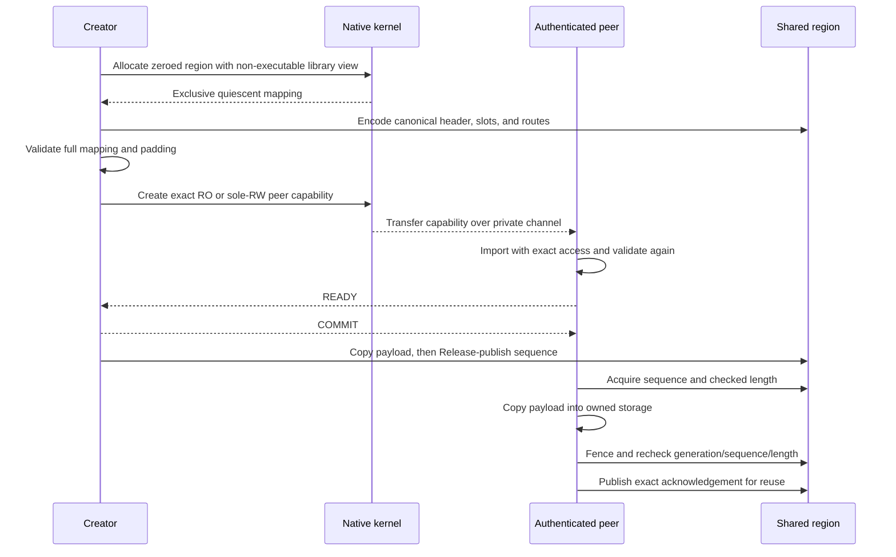

# native-ipc-rs

[](https://github.com/ro-ag/native-ipc-rs/actions/workflows/ci.yml)
[](https://crates.io/crates/native-ipc)
[](https://docs.rs/native-ipc)
[](LICENSE-MIT)
[](rust-toolchain.toml)
[](#supported-targets)

`native-ipc-rs` consolidates safe cross-process shared memory behind a single
Rust library. No portable OS primitive exists for sealed, least-authority
anonymous shared memory — `memfd_create` and file seals are Linux-only, macOS
instead attenuates Mach memory-entry rights, and Windows duplicates
exact-rights section handles — so this workspace pairs one security-oriented,
pointer-free wire/layout core with a native adapter for each kernel's own
mechanism. It is not yet a complete process transport.

## Why this repository exists

**One safe library instead of three unsafe FFI surfaces.** Every mainstream
kernel can share memory with least authority, but each one does it with a
different, non-portable mechanism, and the portable denominators are the weak
ones. POSIX `shm_open` exists across Unix systems but offers a shared, named
namespace and no sealing; `memfd_create`'s anonymous, sealable
objects never left Linux; macOS expresses the same policy as Mach memory
entries whose maximum protection clamps a peer's rights; Windows expresses it
as exact-access duplicated section handles. An application that wants the
strong per-OS behavior otherwise ends up owning three unrelated unsafe FFI
surfaces, three transfer channels, and three peer-authentication schemes.
`native-ipc-rs` consolidates them: one API, one security contract, and the
strongest native object each kernel provides (see
[supported targets](#supported-targets) for the exact mechanism per platform).

**Safety, not just portability.** Shared memory is fast, but a conventional
wrapper can accidentally turn an untrusted process into a holder of writable
aliases, native handles with excess rights, or Rust references whose
invariants another process can violate. Serialization alone does not solve
capability transfer, mapping permissions, peer identity, process cleanup, or
replay across restarts.

This repository addresses both concerns:

- a pointer-free core manually encodes fixed-width wire/layout data and checks
  every hostile length, offset, role, generation, sequence, and resource bound;
- native adapters ask each kernel for least-authority mappings and authenticate
  the exact helper process before transferring them; and
- safe runtime APIs expose owned payload copies and typed reader/writer
  capabilities instead of shared Rust slices.



The workspace contains:

- `native-ipc`: public facade;
- `native-ipc-core`: explicit codecs, checked layouts, publication sequencing,
  and capability bindings;
- `native-ipc-testkit`: golden-vector and adversarial conformance helpers.

Native backends are private modules of `native-ipc`. The superseded 0.4
`native-ipc-platform` package remains available from the `v0.4.0` tag and its
published crate, but is not a vNext workspace package or public API.

## How memory is accessed

Ordinary byte slices exist only while a new mapping is private and quiescent.
The creator writes the canonical layout, validates the complete page-rounded
range, chooses the sole writer, and asks the OS to attenuate the peer's rights.
After authenticated transfer and import, the peer signals `READY` and the
creator acknowledges `COMMIT`; consuming typestates expose runtime APIs only
after that barrier completes. Runtime access remains mapping-owned and never
returns shared references.

The private fixed-width control manifest is application-neutral. It binds each
transaction to authenticated process identities, a unique transfer ID,
canonical opaque region IDs, independent object incarnations, writer/access
direction, ordinals, aggregate totals, and exact logical/mapped lengths. Layout
schemas and generations belong to optional application adapters above this
native transcript. Control operations require exclusive channel access, so
independent transfers cannot interleave.



The recheck bounds memory access and detects metadata changes. It does not make
a malicious writer's payload trustworthy: same-sequence mutation may still
produce a torn owned copy, so protocol decoding must remain hostile-input safe.

## Common memory interface

`native_ipc::memory::NativeRegion` selects the strongest supported anonymous
shared-memory object at compile time — a sealed `memfd` on Linux, a Mach VM
memory entry on macOS, an unnamed section on Windows. Applications describe
intent rather than calling Mach, Unix, or Win32 APIs directly:

```rust
use native_ipc::memory::{
    CleanupPolicy, NativeRegion, RegionOptions, WriterOwner,
};

# fn demo() -> Result<(), native_ipc::memory::MemoryError> {
let options = RegionOptions::growable(
    64 * 1024,             // initial logical bytes
    1024 * 1024,           // maximum before sharing
    WriterOwner::Creator,  // peer receives read-only access
)
.with_cleanup(CleanupPolicy::ClearThenRelease);

let mut region = NativeRegion::allocate(options)?;
region.initialize(|bytes| bytes[..4].copy_from_slice(b"NIPC"));
region.grow(128 * 1024)?; // replaces the still-private mapping
region.clear();           // zero all mapped bytes and keep it reusable
region.destroy();         // zero all mapped bytes, then release explicitly
# Ok(())
# }
```

| Operation | State | Guarantee |
| --- | --- | --- |
| `RegionOptions::fixed` | Before allocation | Mapping cannot grow |
| `RegionOptions::growable` | Private only | Replacement growth up to an explicit maximum |
| `initialize` | Quiescent | Closure sees logical bytes; padding remains hidden and zero |
| `clear` | Quiescent | Volatile-zero the complete mapping and retain it for reuse |
| `destroy` | Quiescent | Volatile-zero, fence, unmap, and close the anonymous object |
| `prepare_for_sharing` | Consuming transition | Remove byte/growth access and retain the seal/permission plan |

Sealing is deliberately not an optional Boolean. `SealPolicy::RequiredOnShare`
is fixed by the safe interface. The consuming platform transition applies
`memfd` seals, Mach maximum rights, or exact Windows handle rights according to
the selected backend. Size, writer ownership, and permissions cannot change
after sharing.

## Examples

Add the public facade with:

```sh
cargo add native-ipc
```

Runnable core examples demonstrate the two pieces applications configure
before native capability transfer:

```sh
cargo run -p native-ipc-core --example bounded_codec
cargo run -p native-ipc-core --example checked_layout
cargo run -p native-ipc-testkit --example hostile_inputs
cargo run -p native-ipc --example common_memory
```

- [`bounded_codec.rs`](crates/native-ipc-core/examples/bounded_codec.rs) defines
  a manual little-endian protocol, encodes an envelope, and decodes it under
  explicit message/payload/allocation limits.
- [`checked_layout.rs`](crates/native-ipc-core/examples/checked_layout.rs)
  composes two directional, single-writer regions with exact acknowledgement
  routes and bounded capacities.
- [`hostile_inputs.rs`](crates/native-ipc-testkit/examples/hostile_inputs.rs)
  generates bounded truncation, bit-mutation, and boundary-value corpora.
- [`common_memory.rs`](crates/native-ipc/examples/common_memory.rs) uses the
  portable fixed/grow/clear/destroy lifecycle without selecting an OS backend.

## Security invariants

- Wire data is manually encoded little-endian fixed-width fields. Rust object
  layouts, pointers, references, `usize`, native handles, and implicit
  serialization formats never cross the boundary.
- Every message and region is bound to a 256-bit schema, a nonzero generation,
  numeric roles, fixed capacity, and checked relative ranges.
- Each mapping has exactly one writer. A peer reader receives only a read-only
  native capability; no shared page is writable by both processes.
- Writers publish with Release ordering. Readers Acquire, copy hostile bytes to
  owned memory, fence, and recheck generation, sequence, and length. This does
  not prove payload integrity or detect malicious same-sequence mutation.
- Ring reuse requires a unique per-slot route with exact owner, target, slot,
  cell, generation, and prior sequence. Equal re-acknowledgement is
  intentionally idempotent for retransmission.
- Store capabilities require a consumed platform sole-writer witness;
  OS-enforced read-only witnesses grant only acquire capabilities.
- Runtime mappings never expose ordinary Rust slices. Slice access exists only
  in consuming, pre-transfer quiescent platform typestates.

## Normative vNext contract

The post-0.4 requirements are specified in
[`docs/native-ipc-vnext-spec.md`](docs/native-ipc-vnext-spec.md). The document
defines the platform-neutral opaque region API, true 1..=16 mixed-direction
atomic batches, session lifecycle, native security rules, VST3-oriented generic
acceptance profile, adversarial test matrix, and release gates.

A fresh implementation session can start from
[`docs/vnext-implementation-prompt.md`](docs/vnext-implementation-prompt.md).

## Current status

The unreleased vNext branch composes the safe public session API on Linux:
one-shot `receiver_main!` bootstrap, bilateral `Session<Ready>` negotiation,
bounded opaque control, atomic mixed-direction batches, checked active mappings,
lease-aware close/abort, and bounded failure/cleanup diagnostics. A macOS Arm64
composition prototype exists privately but the public entry points remain
fail-closed: direct spawn has no PID-reuse-safe termination authority before the
first audit-bearing Mach message without transferring a forbidden task port.
A preinstalled signed launchd/XPC service is a necessary candidate boundary,
but it is insufficient across supervisor crash without additional
crash-surviving OS containment. The result and native evidence gate are
documented in
[`docs/macos-supervisor-boundary.md`](docs/macos-supervisor-boundary.md); no
service artifact exists. This is source-tree evidence with local package
verification; the macOS architecture, Windows parity, exact-tip hosted CI,
exact-release packaged conformance, physical Arm64 evidence, and release
authorization remain outstanding.

Implemented through `0.4.0`:

- generic message envelopes and explicit codec traits with allocation/record
  limits;
- checked configurable directional region and slot layouts;
- role/generation/capacity/index/count/permission-bound reader and writer
  capabilities;
- split acknowledgement reader/writer capabilities and exact reuse checks;
- a common cross-platform native-memory lifecycle API with fixed or bounded
  pre-share growth, mandatory sealing, reusable clearing, and explicit
  clear-and-destroy;
- canonical, manifest-bound `CAPABILITY -> READY -> COMMIT` transactions that
  keep runtime mappings unavailable until both peers finish validation;
- macOS Mach VM quiescent/local-writer/remote-writer typestates, including live
  permission probes, authenticated bootstrap, memory-entry transfer/import,
  READY/COMMIT exchange, and a bidirectional helper-process fixture;
- Linux sealed `memfd`, short-read-safe exact `SCM_RIGHTS`, `SO_PEERCRED`,
  `pidfd`, and owned helper lifecycle;
- Windows least-rights unnamed sections, exact-PID private named pipes,
  suspended Job-contained helpers, and cross-process handle import;
- portable golden vectors, deterministic adversarial fixtures, Miri, and
  bounded coverage-guided fuzz targets.

### Platform capabilities

#### Supported targets

| Platform | Architecture | Rust target | Shared-memory capability | Peer authentication | Lifecycle containment |
| --- | --- | --- | --- | --- | --- |
| Linux | AMD64 | `x86_64-unknown-linux-gnu` | Sealed anonymous `memfd` + exact `SCM_RIGHTS` | `SO_PEERCRED` | `pidfd` + owned helper cleanup |
| Linux | ARM64 | `aarch64-unknown-linux-gnu` | Sealed anonymous `memfd` + exact `SCM_RIGHTS` | `SO_PEERCRED` | `pidfd` + owned helper cleanup |
| macOS | ARM64 | `aarch64-apple-darwin` | Mach memory-entry send rights | Mach audit-token PID | private bootstrap port + reap |
| Windows | AMD64 | `x86_64-pc-windows-msvc` | Least-rights unnamed section handles | both named-pipe endpoint PIDs | suspended spawn + kill-on-close Job |
| Windows | ARM64 | `aarch64-pc-windows-msvc` | Least-rights unnamed section handles | both named-pipe endpoint PIDs | suspended spawn + kill-on-close Job |

The public facade fails compilation on other target combinations. The
platform-neutral `native-ipc-core` crate remains usable
wherever its documented 64-bit atomic requirement is met. CI runs the full
workspace and native permission/helper-process tests on all five targets; no
Intel macOS support is claimed. Linux AMD64 additionally runs every workspace
and native lifecycle test under AddressSanitizer. Leak detection and
stack-use-after-return detection are enabled, and the standard library is
rebuilt with instrumentation so the check covers allocation boundaries beyond
this workspace's crates.

Still intentionally outside the published `0.4` release line are the unreleased
vNext session/supervisor API, payload authenticity or encryption, automatic
guard-page policy, and a stable `1.0` compatibility promise. The published
crates remain low-level building blocks for applications that explicitly own
protocol negotiation, resource budgets, compatibility policy, and guard-page
decisions.

## Toolchain and validation

The MSRV is Rust 1.97 with edition 2024. Before submitting a change, run:

```sh
cargo fmt --all -- --check
cargo clippy --workspace --all-features --all-targets -- -D warnings
cargo test --workspace --all-features --all-targets
cargo test --workspace --no-default-features --all-targets --locked
cargo check --workspace --no-default-features --all-targets
RUSTDOCFLAGS="-D warnings" cargo doc --workspace --all-features --no-deps
cargo deny check
git diff --check
```

The Linux AMD64 sanitizer job uses nightly Rust because sanitizers and
instrumented standard-library builds are not stable compiler features:

```sh
ASAN_OPTIONS="detect_leaks=1:detect_stack_use_after_return=1:halt_on_error=1" \
RUSTFLAGS="-Zsanitizer=address -Cforce-frame-pointers=yes" \
RUSTDOCFLAGS="-Zsanitizer=address -Cforce-frame-pointers=yes" \
cargo +nightly test -Zbuild-std --workspace --all-features --all-targets \
  --locked --target x86_64-unknown-linux-gnu
```

The project is dual-licensed under [MIT](LICENSE-MIT) or
[Apache-2.0](LICENSE-APACHE), at your option.
